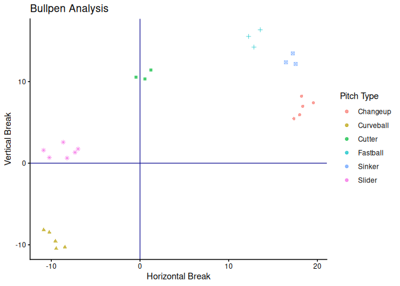
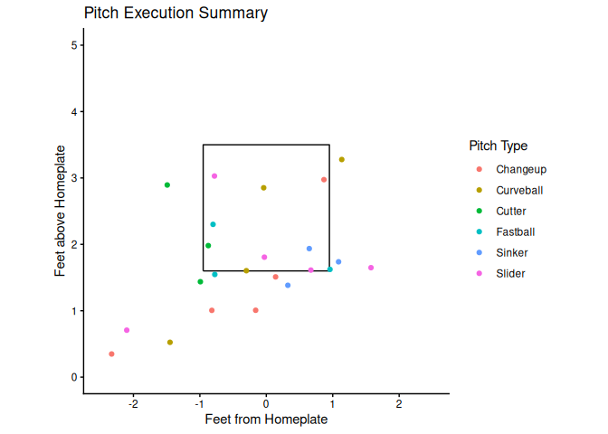

<!-- README.md is generated from README.Rmd. Please edit that file -->

# BSBReport

<!-- badges: start -->

<!-- badges: end -->

The goal of BSBReport is to assist in analyzing trackman data from
bullpens or live at bats. BSBReport generates multiple plots and tables
to better understand pitch data for future execution and pitch design
programming. It utilizes trackman raw data, which contains ball flight
metrics from each pitch captured. Within these metrics, this package
focuses on Pitch Velocity, Induced Vertical Break, Horizontal Break, and
Plate Location.

- *Pitch Velocity*: The velocity recorded when the ball leaves the
  pitchers hand
- *Induced Vertical Break*: The amount of movement, in inches, applied
  to the ball via spin from the pitcher accounting for gravity. Can
  think of as the applied movement from the pitcher for a pitch.
- *Horizontal Break*: The amount of movement, in inches, applied to the
  ball via spin from the pitcher in the horizontal plane. Offspeed
  pitches usually have higher HB values on account of their increased
  side spin.
- *Plate Location*: Location approximate to where the ball crosses home
  plate. Displayed as “Pitch Height” and “Pitch Side”, can be plotted to
  visualize and calculate strike percentage.

## Installation

You can install the development version of BSBReport from
[GitHub](https://github.com/) with:

``` r
# install.packages("devtools")
# install.packages("remotes")
devtools::install_github("ADC-405-S26/BSBReport")
```

## Examples

BSB Report has three main functions to view pitch movement data, pitch
location data, and summary data from a session. There are 3 functions to
use, each relating to a different aspect of bullpen data. To use
**BSBReport**, a standard trackman file must be used. When looking at
our demo data, you can see two distinct PitcherIds, as well as the pitch
type and other key metrics.

``` r
library(BSBReport)
head(trackman_data)
#>    PitcherId TaggedPitchType PitchCount InducedVertBreak HorzBreak
#> 1 1122334455        Fastball          1           15.532    12.240
#> 2 2233445566        Fastball          2           14.226    12.843
#> 3 2233445566        Fastball          3           16.349    13.555
#> 4 2233445566          Cutter          4           11.443     1.223
#> 5 1122334455          Cutter          5           10.342     0.566
#> 6 1122334455          Cutter          6           10.550    -0.445
#>   PlateLocHeight PlateLocSide RelSpeed
#> 1        1.54649     -0.77511 88.23450
#> 2        1.62280      0.95868 89.43440
#> 3        2.30084     -0.80157 87.33450
#> 4        1.98087     -0.87330 84.42350
#> 5        2.89414     -1.49088 83.72340
#> 6        1.43716     -0.99222 84.61345
```

### Pitch_Plot example

**Pitch_Plot** can be used to visualize and summarize movement data from
a session. The output yields a color-shape coded movement plot and a
summary table with averages for relevant metrics.

``` r
library(dplyr)
library(ggplot2)
library(knitr)
Pitch_Plot(trackman_data)
#> $plot
```



    #> 
    #> $table
    #> # A tibble: 6 × 5
    #>   TaggedPitchType Pitch_Count Avg_Speed Avg_Vertical_Break Avg_Horizontal_Break
    #>   <chr>                 <int>     <dbl>              <dbl>                <dbl>
    #> 1 Changeup                  5      81.7               6.8                 18.3 
    #> 2 Curveball                 5      76.3              -9.39                -9.71
    #> 3 Cutter                    3      84.2              10.8                  0.45
    #> 4 Fastball                  3      88.3              15.4                 12.9 
    #> 5 Sinker                    3      87.3              12.7                 17.1 
    #> 6 Slider                    6      80.3               1.42                -8.72

### Plate_Viz example

**Plate_Viz** examines the location of pitches relative to the strike
zone and the plate. Offering a table with exact location averages along
with other relevant metrics, the subsequent plot gives a visual for
where pitches landed when compared to the strike zone.

``` r
library(dplyr)
library(ggplot2)
library(knitr)
Plate_Viz(trackman_data)
#> $plot
```



    #> 
    #> $table
    #> # A tibble: 6 × 5
    #>   TaggedPitchType Pitch_Count Avg_Speed Avg_Plate_Height Avg_Plate_Side
    #>   <chr>                 <int>     <dbl>            <dbl>          <dbl>
    #> 1 Changeup                  5      81.7             1.37          -0.46
    #> 2 Curveball                 5      76.3             1.58          -0.7 
    #> 3 Cutter                    3      84.2             2.1           -1.12
    #> 4 Fastball                  3      88.3             1.82          -0.21
    #> 5 Sinker                    3      87.3             1.69           0.69
    #> 6 Slider                    6      80.3             1.38          -0.6

### Master_Summary example

The command **Master_Summary** can be used to get a full analysis of
both movement and location data. It also contains a *Strike Percentage*
calculation based on the standard strike zone measurements.

``` r
library(dplyr)
library(ggplot2)
library(knitr)
library(kableExtra)

Master_Summary(trackman_data)
```

<table class="table" style="margin-left: auto; margin-right: auto;">

<thead>

<tr>

<th style="text-align:left;">

Pitch Type
</th>

<th style="text-align:right;">

Pitch Count
</th>

<th style="text-align:right;">

Velocity (mph)
</th>

<th style="text-align:left;">

Strike Percentage
</th>

<th style="text-align:right;">

Vertical Break (in)
</th>

<th style="text-align:right;">

Horizontal Break (in)
</th>

<th style="text-align:right;">

Location Height (ft)
</th>

<th style="text-align:right;">

Location Side (ft)
</th>

</tr>

</thead>

<tbody>

<tr>

<td style="text-align:left;">

Slider
</td>

<td style="text-align:right;">

6
</td>

<td style="text-align:right;">

80.27
</td>

<td style="text-align:left;">

<span style=" font-weight: bold;    color: lightgrey !important;border-radius: 4px; padding-right: 4px; padding-left: 4px; background-color: rgba(252, 253, 191, 179) !important;">50</span>
</td>

<td style="text-align:right;">

1.42
</td>

<td style="text-align:right;">

-8.72
</td>

<td style="text-align:right;">

1.38
</td>

<td style="text-align:right;">

-0.60
</td>

</tr>

<tr>

<td style="text-align:left;">

Curveball
</td>

<td style="text-align:right;">

5
</td>

<td style="text-align:right;">

76.31
</td>

<td style="text-align:left;">

<span style=" font-weight: bold;    color: lightgrey !important;border-radius: 4px; padding-right: 4px; padding-left: 4px; background-color: rgba(241, 96, 93, 179) !important;">40</span>
</td>

<td style="text-align:right;">

-9.39
</td>

<td style="text-align:right;">

-9.71
</td>

<td style="text-align:right;">

1.58
</td>

<td style="text-align:right;">

-0.70
</td>

</tr>

<tr>

<td style="text-align:left;">

Cutter
</td>

<td style="text-align:right;">

3
</td>

<td style="text-align:right;">

84.25
</td>

<td style="text-align:left;">

<span style=" font-weight: bold;    color: lightgrey !important;border-radius: 4px; padding-right: 4px; padding-left: 4px; background-color: rgba(158, 47, 127, 179) !important;">33.3</span>
</td>

<td style="text-align:right;">

10.78
</td>

<td style="text-align:right;">

0.45
</td>

<td style="text-align:right;">

2.10
</td>

<td style="text-align:right;">

-1.12
</td>

</tr>

<tr>

<td style="text-align:left;">

Fastball
</td>

<td style="text-align:right;">

3
</td>

<td style="text-align:right;">

88.33
</td>

<td style="text-align:left;">

<span style=" font-weight: bold;    color: lightgrey !important;border-radius: 4px; padding-right: 4px; padding-left: 4px; background-color: rgba(158, 47, 127, 179) !important;">33.3</span>
</td>

<td style="text-align:right;">

15.37
</td>

<td style="text-align:right;">

12.88
</td>

<td style="text-align:right;">

1.82
</td>

<td style="text-align:right;">

-0.21
</td>

</tr>

<tr>

<td style="text-align:left;">

Sinker
</td>

<td style="text-align:right;">

3
</td>

<td style="text-align:right;">

87.32
</td>

<td style="text-align:left;">

<span style=" font-weight: bold;    color: lightgrey !important;border-radius: 4px; padding-right: 4px; padding-left: 4px; background-color: rgba(158, 47, 127, 179) !important;">33.3</span>
</td>

<td style="text-align:right;">

12.66
</td>

<td style="text-align:right;">

17.07
</td>

<td style="text-align:right;">

1.69
</td>

<td style="text-align:right;">

0.69
</td>

</tr>

<tr>

<td style="text-align:left;">

Changeup
</td>

<td style="text-align:right;">

5
</td>

<td style="text-align:right;">

81.66
</td>

<td style="text-align:left;">

<span style=" font-weight: bold;    color: lightgrey !important;border-radius: 4px; padding-right: 4px; padding-left: 4px; background-color: rgba(0, 0, 4, 179) !important;">20</span>
</td>

<td style="text-align:right;">

6.80
</td>

<td style="text-align:right;">

18.29
</td>

<td style="text-align:right;">

1.37
</td>

<td style="text-align:right;">

-0.46
</td>

</tr>

</tbody>

</table>
