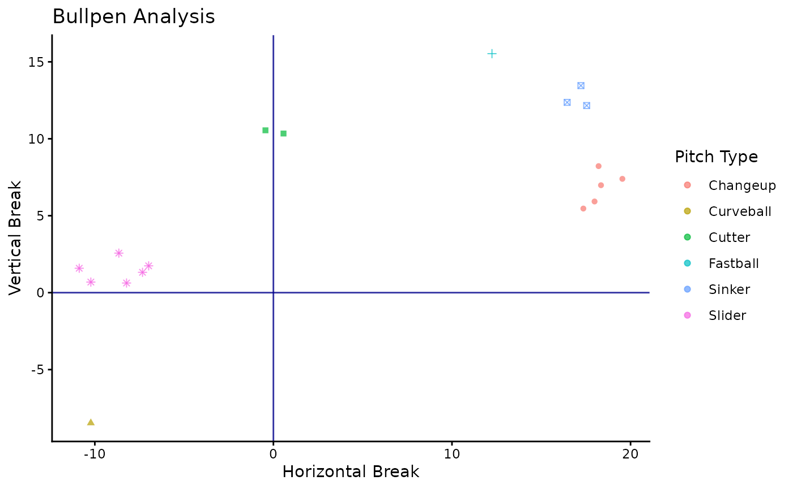
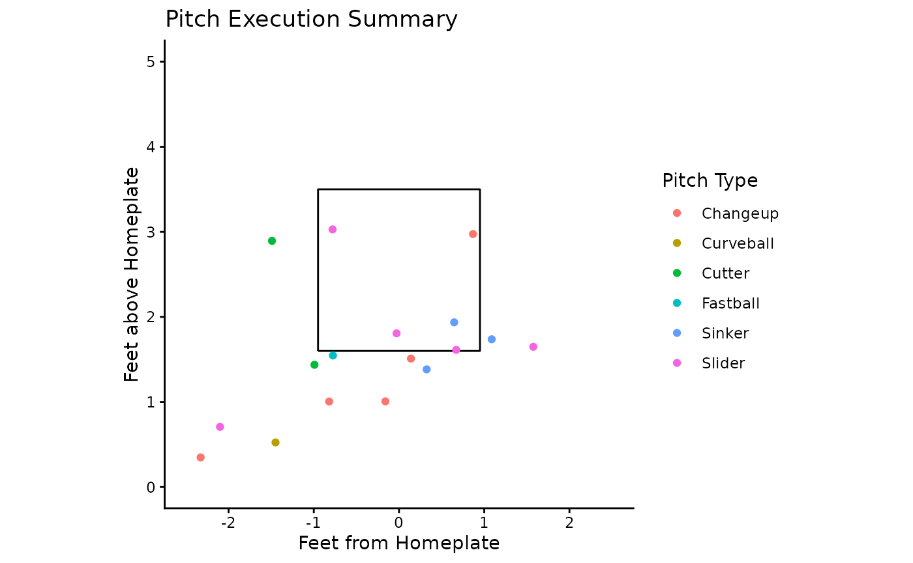

# Sample Workflow with BSBReport

The `BSBReport` can provide multiple insights into a bullpen in terms of
pitch quality, location, and velocity. To get started, you can install
the package like this

``` r

# install.packages("devtools")
# install.packages("remotes")
devtools::install_github("ADC-405-S26/BSBReport")
library(BSBReport)
```

### Loading and Exploration

Once installed, we can load the package take a peak at the dataset. This
demo data has 25 pitches, and 2 distinct Players (1122334455 and
2233445566). For this workflow, we want to look specifically at Player 1
(1122334455). To only select this players pitches, we get into the
second parameter of the package. *PlayerId* can be specified in any call
along with the dataset name. We will make a note of the PlayerId we want
and save it for future use.

``` r

library(BSBReport)
head(trackman_data)
#>    PitcherId TaggedPitchType PitchCount InducedVertBreak HorzBreak
#> 1 1122334455        Fastball          1           15.532    12.240
#> 2 2233445566        Fastball          2           14.226    12.843
#> 3 2233445566        Fastball          3           16.349    13.555
#> 4 2233445566          Cutter          4           11.443     1.223
#> 5 1122334455          Cutter          5           10.342     0.566
#> 6 1122334455          Cutter          6           10.550    -0.445
#>   PlateLocHeight PlateLocSide RelSpeed
#> 1        1.54649     -0.77511 88.23450
#> 2        1.62280      0.95868 89.43440
#> 3        2.30084     -0.80157 87.33450
#> 4        1.98087     -0.87330 84.42350
#> 5        2.89414     -1.49088 83.72340
#> 6        1.43716     -0.99222 84.61345
Demo_Player <- 1122334455
```

### Pitch_Plot: Movement Data

One essential in bullpen analysis is a pitch movement plot, identifying
the various pitch types and their “profiles”. In devleoping a good
arsenal, understanding the movement profile is needed to change grips,
intent, or general movement trends. To do so, we can use *Pitch_Plot*.
This function outputs both a summary table and a plot of the pitch
movement data. In our call, we specify that *PlayerId* to select for one
pitcher.

``` r

library(dplyr)
library(ggplot2)
library(knitr)
Pitch_Plot(trackman_data, PlayerId = Demo_Player)
#> $plot
```



    #> 
    #> $table
    #> # A tibble: 6 × 5
    #>   TaggedPitchType Pitch_Count Avg_Speed Avg_Vertical_Break Avg_Horizontal_Break
    #>   <chr>                 <int>     <dbl>              <dbl>                <dbl>
    #> 1 Changeup                  5      81.7               6.8                 18.3 
    #> 2 Curveball                 1      77.3              -8.47               -10.2 
    #> 3 Cutter                    2      84.2              10.4                  0.06
    #> 4 Fastball                  1      88.2              15.5                 12.2 
    #> 5 Sinker                    3      87.3              12.7                 17.1 
    #> 6 Slider                    6      80.3               1.42                -8.72

The plotted output groups pitch types by color and shape, allowing for
clear distinctions. To look at exact averages, the table provides the
information. With this data you can make practical insights for pitch
quality and consistency. The other key component of understanding a
pitchers data is their location and execution. This is where *Plate_Viz*
and *Master_Summary* come into play.

### Plate_Viz and Master_Summary

The two other primary functions revolve around this location and
execution side of pitch design. First, to visualize the general trends
in strike zone misses based on pitch type, *Plate_Viz* works the best.
Built using standard zone measurements (plate and height dimensions),
the plot and table use plate location data from trackman to map out what
pitches are messing where. The table gives us averages based on pitch
type once again, allowing for a birds eye view of pitch location

``` r

library(dplyr)
library(ggplot2)
library(knitr)
Plate_Viz(trackman_data, PlayerId = Demo_Player)
#> $plot
```



    #> 
    #> $table
    #> # A tibble: 6 × 5
    #>   TaggedPitchType Pitch_Count Avg_Speed Avg_Plate_Height Avg_Plate_Side
    #>   <chr>                 <int>     <dbl>            <dbl>          <dbl>
    #> 1 Changeup                  5      81.7             1.37          -0.46
    #> 2 Curveball                 1      77.3             0.52          -1.45
    #> 3 Cutter                    2      84.2             2.17          -1.24
    #> 4 Fastball                  1      88.2             1.55          -0.78
    #> 5 Sinker                    3      87.3             1.69           0.69
    #> 6 Slider                    6      80.3             1.38          -0.6

The command **Master_Summary** can be used to get a full analysis of
both movement and location data. The “bang for your buck” function
prints an *html* table, rendering in higher quality. It also contains a
*Strike Percentage* calculation based on the standard strike zone
measurements. A nasty pitch from a movement perspective is only
effective if it can be thrown in the strike zone. To get an easy sense
of strike percentage, the column is color-coded and ranked in descending
order.

``` r

library(dplyr)
library(ggplot2)
library(knitr)
library(kableExtra)

Master_Summary(trackman_data, PlayerId = Demo_Player)
```

| Pitch Type | Pitch Count | Velocity (mph) | Strike Percentage | Vertical Break (in) | Horizontal Break (in) | Location Height (ft) | Location Side (ft) |
|:---|---:|---:|:---|---:|---:|---:|---:|
| Slider | 6 | 80.27 | 50 | 1.42 | -8.72 | 1.38 | -0.60 |
| Sinker | 3 | 87.32 | 33.3 | 12.66 | 17.07 | 1.69 | 0.69 |
| Changeup | 5 | 81.66 | 20 | 6.80 | 18.29 | 1.37 | -0.46 |
| Curveball | 1 | 77.28 | 0 | -8.47 | -10.22 | 0.52 | -1.45 |
| Cutter | 2 | 84.17 | 0 | 10.45 | 0.06 | 2.17 | -1.24 |
| Fastball | 1 | 88.23 | 0 | 15.53 | 12.24 | 1.55 | -0.78 |

As we can see, the sinker and changeup command was not in a great spot,
with the slider being the most accurate pitch of the session. Together,
the functions in **BSBReport** allow for key analytical insights into
bullpen quality and assessment.
